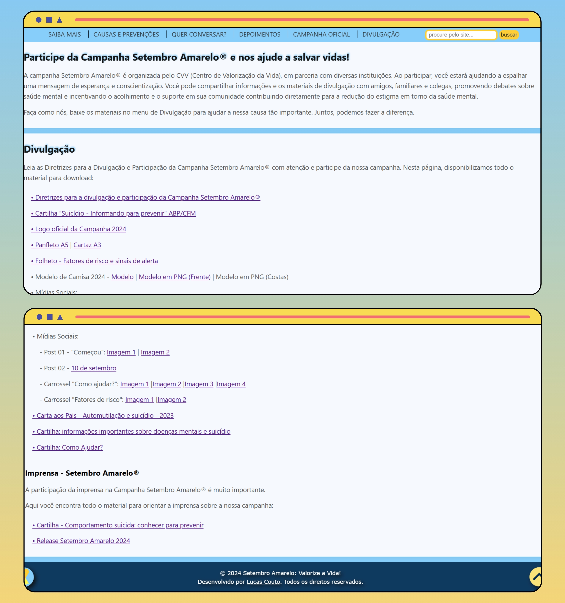

<h1 align="center">SETEMBRO AMARELO 🎗️</h1>

<div>
  
[](./LICENSE)&nbsp;&nbsp;
[]()

</div>
 
> O projeto foi desenvolvido com **HTML, CSS e JavaScript** e inspirado no **site oficial da campanha Setembro Amarelo®** com um design que busca ser atrativo e acessível. Esta plataforma reúne **informações importantes sobre o movimento, contatos de apoio para quem precisa e material para divulgação**, contribuindo para promover a conscientização e importância desse movimento.

<p align="center">
  <a href="#-projeto">Projeto</a>&nbsp;&nbsp;&nbsp;|&nbsp;&nbsp;&nbsp;
  <a href="#-funcionalidades">Funcionalidades</a>&nbsp;&nbsp;&nbsp;|&nbsp;&nbsp;&nbsp;
  <a href="#-tecnologias-e-ferramentas">Tecnologias e Ferramentas</a>&nbsp;&nbsp;&nbsp;|&nbsp;&nbsp;&nbsp;
  <a href="#-estruturação-do-projeto">Guia Repositório</a>
</p>

<h2>🌐 PROJETO</h2>
<h5>Acesse e confira o projeto em ação:</h5>

- 🔗 <a href="https://lucas16716.github.io/setembro-amarelo/">GitHub Pages
- 📹 <a href="https://drive.google.com/file/d/1gq1bJRB8ZH7NV1mHLzFkXgGT-SVYWEil/view?usp=sharing">Vídeo do Projeto
- 🖼️ Imagens do Projeto:

<div align="left">
  
   <a target="_blank" href="https://lucas16716.github.io/setembro-amarelo/">
   
   </a>

   <a target="_blank" href="https://lucas16716.github.io/setembro-amarelo/">
   
   </a>
   
 </div>

 <h2>🚀 FUNCIONALIDADES</h2>

- **Menu interativo:** rolagem suave para cada seção com menu que desliza e retorna conforme a navegação;
- **Barra de pesquisa:** Permite localizar palavras específicas no site;
- **Seções do site:** sobre o movimento, causas e prevenções, contatos de ajuda, depoimentos e campanha oficial com material de divulgação;
- **Botão "Voltar ao topo":** Navegação rápida para o início da página;
- **Barra de rolagem personalizada:** Estilização em amarelo, representando o tema.

<h4>Melhorias Futuras</h4>

- 📲 Design responsivo para adaptar-se a tela de diferentes dispositivos;
- 🗃️ Inclusão de formulário para que as pessoas possam compartilhar seus depoimentos de forma anônima ou identificada;
- 🎨 Estilizações e animações CSS para uma experiência mais intuitiva e atrativa.

<h2>💻 TECNOLOGIAS E FERRAMENTAS</h2>

- **HTML5:** Estrutura semântica;
- **CSS3:** Estilos e responsividade;
- **JavaScript:** Interatividade e lógica;
- **Git/GitHub:** Versionamento de código;
- **Canva:** Logo, banner e mockup.

---

<h2>🏗 ESTRUTURAÇÃO DO PROJETO</h2>

```bash
📁 setembro-amarelo
├── 📁 docs
│   ├── 📂 imagens              # Imagens do projeto
│   │   └── 📂 banner
│   │   ├── 📂 dv
│   │   └── 📂 icons
│   ├─  script.js                # Código JS
│   ├─  style.css                # Código CSS
│   └── index.html               # Página principal
├── .gitignore                   # Itens irrelevantes
├── README.md                    # Documentação
└── LICENSE                      # Licença
```

<h2>👥 CLONAR O REPOSITÓRIO</h2>

1. Clone este repositório no seu computador:

```
git clone https://github.com/lucas16716/setembro-amarelo.git
```

2. Abra o arquivo `index.html` no seu navegador:

```
cd setembro-amarelo
open index.html
```

<h2>🤝 CONTRIBUIÇÃO</h2>
<h4>Contribuições são sempre bem-vindas!</h4>

1. Faça um _fork_;
2. Crie uma nova _branch_ (`git checkout -b minha-feature`);
3. Faça _commit_ das alterações (`git commit -m 'Adicionei algo incrível!'`);
4. Faça _push_ para a branch (`git push origin minha-feature`);
5. Abra um _Pull Request_.

---

<h2>💬 AGRADECIMENTOS</h2>
Agradeço à Alura, Google Gemini e aos instrutores que tornaram possível este aprendizado, além do apoio de todos os envolvidos na campanha Setembro Amarelo®. Vamos juntos conscientizar e salvar vidas!

<h2>📝 LICENÇA</h2>
<p>Este projeto está sob a licença MIT, que permite uso, modificação e distribuição para fins pessoais e comerciais. Confira os detalhes na documentação oficial.</p>

<h2>🧑🏻‍💻 AUTOR </h2>
<p>Desenvolvido por <a href="https://lucaslinkverse.vercel.app/">Lucas Couto<a/> com amor, dedicação e a busca por aprendizado constante.</p>
