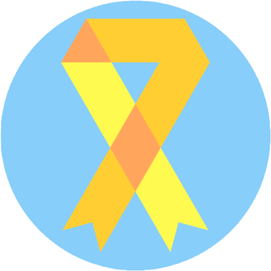

<div align="center">



# Setembro Amarelo

**Site informativo dedicado à Campanha Setembro Amarelo 2024**

*Primeiro projeto autoral — início da minha jornada na programação*

[]()&nbsp;
[](./LICENSE)&nbsp;
[]()

</div>

<p align="center">
  <a href="#projeto">Projeto</a>&nbsp;&nbsp;&nbsp;|&nbsp;&nbsp;&nbsp;
  <a href="#funcionalidades">Funcionalidades</a>&nbsp;&nbsp;&nbsp;|&nbsp;&nbsp;&nbsp;
  <a href="#tecnologias">Tecnologias</a>&nbsp;&nbsp;&nbsp;|&nbsp;&nbsp;&nbsp;
  <a href="#estrutura">Estrutura</a>
</p>

<h2 id="projeto">PROJETO</h2>

Site informativo dedicado à **Campanha Setembro Amarelo**, utilizando o material oficial da Campanha 2024, com o objetivo de **reunir informações essenciais e conectar pessoas a canais de apoio**, reforçando a **importância do cuidado com a saúde mental**.

Este foi meu primeiro projeto autoral — desenvolvido para praticar HTML, CSS e JavaScript na construção de uma interface real, com propósito.

🌐 [Acesse o site](https://lucas16716.github.io/setembro-amarelo/)&nbsp;&nbsp;|&nbsp;&nbsp;📸 [Sobre o projeto](https://www.instagram.com/p/DObHM7FkcN7/?img_index=1)

<h2 id="funcionalidades">FUNCIONALIDADES</h2>

- **Menu interativo** — rolagem suave para cada seção com menu que desliza e retorna conforme a navegação
- **Barra de pesquisa** — localização de palavras específicas no conteúdo do site
- **Seções de conteúdo** — sobre o movimento, causas e prevenção, contatos de apoio, depoimentos e material oficial da campanha
- **Botão "Voltar ao topo"** — navegação rápida para o início da página
- **Barra de rolagem personalizada** — estilizada em amarelo, representando o tema

**Melhorias previstas para v2.0**
- Design responsivo para diferentes dispositivos
- Formulário para envio anônimo ou identificado de depoimentos

<h2 id="tecnologias">TECNOLOGIAS</h2>

| Tecnologia | Uso |
|---|---|
| HTML5 | Estrutura semântica |
| CSS3 | Estilos e layout |
| JavaScript | Interatividade e lógica |
| Git/GitHub | Versionamento de código |
| Canva | logo, banner e mockup |

<h2 id="estrutura">ESTRUTURA</h2>

```
setembro-amarelo/
├── docs/
│   ├── images/
│   │   ├── banner/          → Banners da campanha
│   │   ├── dv/              → Material de divulgação
│   │   └── icons/           → Ícones do projeto
│   ├── script.js            → JavaScript
│   ├── style.css            → Estilos
│   └── index.html           → Página principal
├── .gitignore
├── LICENSE
└── README.md
```

---

<h2>AGRADECIMENTOS</h2>
Agradeço à Alura, Google Gemini e aos instrutores que tornaram possível este aprendizado, além do apoio de todos os envolvidos na campanha Setembro Amarelo®. Vamos juntos conscientizar e salvar vidas!

<h2>LICENÇA</h2>

Este projeto está sob a licença MIT, que permite uso, modificação e distribuição para fins pessoais e comerciais.
Veja o arquivo [LICENSE](./LICENSE) para mais detalhes.

<h2>AUTOR </h2>

Desenvolvido por [Lucas Couto](https://linkedin.com/in/lucas-coutoti).  
Veja meu trabalho em [Lucas Code](https://bio.site/lucascode).
